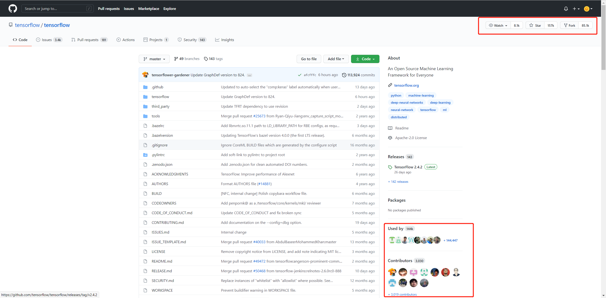
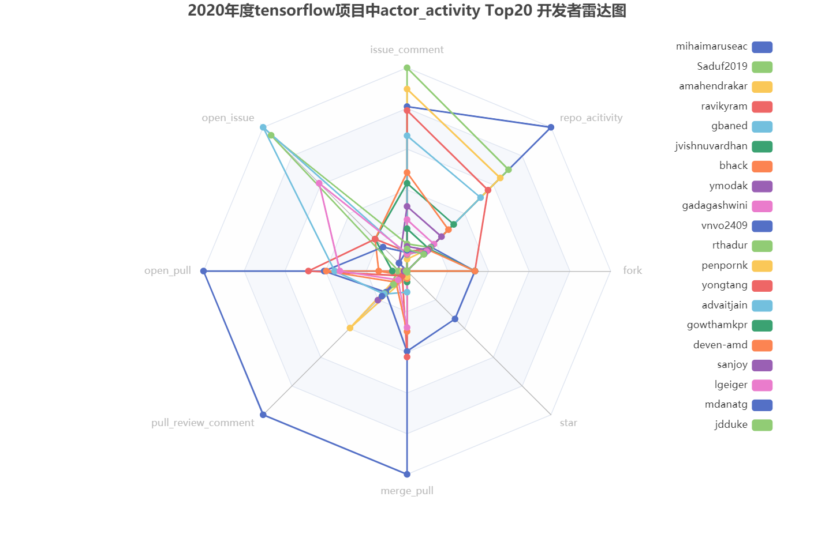
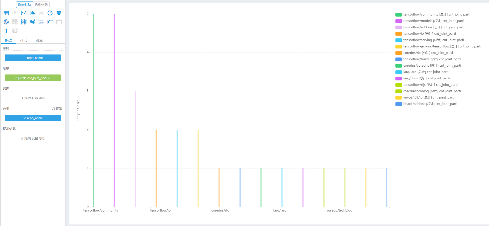

# Tensorflow 2020 数据分析报告

分析数据来源：[tensorflow/tensorflow](https://github.com/tensorflow/tensorflow) 2020年用户行为日志数据

by: Group_11(娄泽华，唐海波，阙琦峰)

## 1 数据类

### 1.1 基础的统计数据分析、可视化

tensorflow/tensorflow是TensorFlow的GitHub开源项目。TensorFlow 是一个端到端的机器学习开源平台。 它拥有一个由工具、库和社区资源组成的全面、灵活的生态系统，使研究人员能够推动 ML 的最新技术，而开发人员可以轻松构建和部署 ML 驱动的应用程序。

TensorFlow 最初由 Google 机器智能研究组织内的 Google Brain 团队的研究人员和工程师开发，用于进行机器学习和深度神经网络研究。 该系统的通用性足以适用于各种其他领域。

当前（2021年7月）tensorflow/tensorflow项目累计总量：Star 157k，Fork 85.1k，Used by 144k，Contributors 3030，相比于theano、keras、pytorch、PaddlePaddle等机器学习平台开源项目有着绝对的社区规模优势（见表1）。

表1 GitHub平台机器学习平台开源项目累计使用情况粗略对比

| repo_name | star( k ) | fork( k ) | Used_by( k ) | Contributors |
| --------- | ------------- | ---------- | --------- | ------------------- |
|[tensorflow](https://github.com/tensorflow)/**[tensorflow](https://github.com/tensorflow/tensorflow)**	|157	|85.1	|144	|3030	|
|[Theano](https://github.com/Theano)/**[Theano](https://github.com/Theano/Theano)**	| 9.4       |2.5	| 11.1         |352	|
|[keras-team](https://github.com/keras-team)/**[keras](https://github.com/keras-team/keras)**	| 51.9      |18.7	| unknown      |898	|
|[pytorch](https://github.com/pytorch)/**[pytorch](https://github.com/pytorch/pytorch)**	| 49.4      |13.4	| 82.3         |1910	|
|[PaddlePaddle](https://github.com/PaddlePaddle)/**[Paddle](https://github.com/PaddlePaddle/Paddle)**	| 16        |3.9	| 1.1          |436	|

故选择tensorflow作为调查对象。tensorflow/tensorflow的项目概况如图1所示：

图1 tensorflow

仅分析tensorflow/tensorflow在**2020年度**的项目活跃度，可以看出该项目在排名中位列第21，活跃度308.79，如表2所示。

表2 GitHub 2020年全域项目活跃度 Top 30（项目的各项指标均大于0）

| repo_name | issue_ comment | open_issue | open_pull | pull_ review_ comment | merge_pull | star | fork | repo_activity |
| --------- | ------------- | ---------- | --------- | ------------------- | ---------- | ---- | ---- | ----------- |
|pddemo/demo	|0	|251354	|0	|0	|0	|1	|0	|971.2251566383451|
|google-test/signcla-probe-repo	|138621	|0	|104135	|0	|0	|1	|0	|871.5482823062531|
|test-organization-kkjeer/app-test	|109172	|40226	|47731	|7529	|18169.31	|1	|0	|703.0669841935637|
|elastic/kibana	|145309	|9838	|22891	|45224	|17094.26	|2202	|1293	|697.950251541232|
|test-organization-kkjeer/bot-validation	|104083	|40242	|47729	|7425	|17724.20	|2	|0	|691.3141223233523|
|ouyanxia2/hgmgmg	|4	|162355	|0	|0	|0	|0	|0	|627.3422912393443|
|imamandrews/ imamandrews.github.io	|79182	|104764	|13	|0	|0	|3	|2	|621.2233518767804|
|kubernetes/kubernetes	|235006	|3897	|6868	|30721	|3984.25	|13327	|6181	|601.590606500223|
|flutter/flutter	|126337	|17538	|7222	|18438	|4124.31	|33130	|6714	|583.788590766972|
|NixOS/nixpkgs	|84113	|4489	|26407	|30328	|18371.82	|1798	|1956	|538.0787928700676|
|microsoft/vscode	|99180	|23349	|1977	|1780	|1220.79	|23347	|6470	|432.1952378966484|
|rust-lang/rust	|103937	|4799	|7809	|25194	|5039.93	|10912	|1820	|422.8175092061143|
|Ramos-dev/jniwebshell	|0	|108092	|0	|0	|0	|2	|0	|417.6698699017579|
|dotnet/runtime	|81740	|7886	|7942	|40000	|5662.51	|4007	|1616	|415.2017502069554|
|**pytorch/pytorch**	|**67923**	|**5805**	|**12165**	|**38319**	|**283.22**	|**11781**	|**4313**	|**413.4156619682172**|
|home-assistant/core	|76135	|6101	|7987	|30681	|5621.01	|9832	|5526	|388.6150539324425|
|MicrosoftDocs/azure-docs	|85504	|17367	|5165	|1015	|2790.97	|1709	|3828	|338.9740273888836|
|apache/spark	|138874	|0	|3877	|32252	|1.80	|4581	|3263	|324.6961016095656|
|elastic/elasticsearch	|40330	|3610	|12515	|22599	|9791.75	|7848	|4202	|319.48295248703926|
|odoo/odoo	|54666	|1706	|19392	|19509	|26.79	|4521	|2879	|312.7698512660069|
|**tensorflow/tensorflow**	|**62952**	|**7277**	|**3126**	|**7960**	|**1909.55**	|**17321**	|**8392**	|**308.79429682928463**|
|labuladong/fucking-algorithm	|679	|261	|360	|37	|123.12	|81970	|15273	|285.6667918040059|
|BoltunovOleg/ChatRoulette	|12	|69970	|14	|0	|5.08	|0	|0	|270.47474096638035|
|istio/istio	|82976	|4338	|5519	|14572	|3826.89	|5361	|1465	|257.1969447852387|
|SmartThings Community/ SmartThingsPublic	|878	|14	|37512	|1790	|484.70	|463	|16247	|251.74276745775572|
|kubernetes/website	|54180	|2222	|5139	|21281	|3345.07	|706	|3304	|242.5517143350943|
|cockroachdb/cockroach	|55887	|7682	|6819	|4096	|4957.73	|2424	|564	|235.95325081198027|
|pandas-dev/pandas	|32697	|2906	|5282	|21512	|3870.24	|5835	|3563	|235.32524237548714|
|jwasham/coding- interview-university	|246	|92	|138	|22	|37.818	|63162	|16011	|234.24001864163006|
|codelingo/gh_int_test	|7	|0	|17588	|27574	|0	|0	|1	|233.49347951306316|

取GitHub 2020年全域项目活跃度 Top 30中的各项最大值如表3所示，

表3 GitHub 2020年全域项目活跃度 Top 30中的各项最大值

| locmax_ issue\_ comment | locmax\_ open_issue | locmax\_ open_pull | locmax\_ pull\_ review\_ comment | locmax\_ merge_pull | locmax\_ star | locmax\_ fork | locmax\_ repo_activity |
| ----------------------------- | ---------------------- | ---------------------- | ----------------------------------------- | ---------------------- | ---------------- | ---------------- | ------------------------- |
| 235006                        | 251354                 | 104135                 | 45224                                     | 18371.827000000045     | 81970            | 16247            | 971.2251566383451         |

以活跃度Top30中的pytorch社区为对比对象，对比tensorflow与pytorch的各项指标的雷达图见图2，其中雷达图的边界由表3确定。可以看出tensorflow在issue_comment, open_issue方面与pytorch相当，在open_pull, pull_review_comment等方面显著地弱于pytorch，在merge_pull, star, fork等方面强于pytorch，综合repo_activity弱于pytorch。注意到2020年的issue_comment, open_issue方面tensorflow与pytorch相当，而其他方面显著不同，推测：

a. tensorflow的中心性相对pytorch较强，更偏重于由核心开发团队维护，用较少的open_pull和pull_review_comment完成了较多的合并，贡献者的交流相对较少，可能是核心开发团队在github以外的交流较多造成的。（若是tensorflow本身对于贡献者而言涉及知识广度低或问题明确，不需要较多的pr交流，则无法解释open_pull只有open_issue一半的反常现象，显然提出的问题无法被有效地尝试解决，再结合tensorflow本身的数学复杂度、工程复现复杂度和有更庞大的社区规模等特性，可以推测贡献者对问题本身的理解已经有较高的门槛。）

b. tensorflow更像是生产者消费者模式，在open_pull, pull_review_comment等方面显著地弱于pytorch，在merge_pull, star, fork等方面强于pytorch，说明该项目相比于pytorch，更偏向于用户反馈issue，团队解决issue，交由用户使用的模式，存在着贡献者与用户相对分化的现象。

图2 tensorflow vs pytorch雷达图

### 1.2 开发者数据统计、可视化

#### 1.2.1 2020 tensorflow actor_activity Top20 开发者数据统计

统计了2020年度tensorflow项目中actor_activity最高20个开发者（筛除了登录名中含有bot的用户）的各项指标，sql见文件`2020-tensorflow-actor_activity-Top20.sql`，数据如表4所示：

表4 2020年度tensorflow项目中actor_activity Top20 开发者数据统计

| actor_login | issue_ comment | open_issue | open_pull | pull\_ review\_ comment | merge_pull | star | fork | actor_activity |
| ----------- | ----------------- | ---------- | --------- | ----------------------------- | ---------- | ---- | ---- | --------------- |
|mihaimaruseac	|1995	|0	|194	|853	|149.58399999999997	|0	|0	|3313.1180521609017|
|**Saduf2019**	|**2466**	|**0**	|**0**	|**0**	|**0**	|**0**	|**0**	|**2336.0751017255534**|
|**amahendrakar**	|**2208**	|**0**	|**0**	|**0**	|**0**	|**0**	|**0**	|**2145.5676206072517**|
|ravikyram	|1948	|0	|1	|0	|0	|0	|1	|1864.3685523531092|
|gbaned	|1642	|0	|2	|26	|0	|0	|0	|1692.1920236764956|
|jvishnuvardhan	|1065	|4	|14	|1	|8.114	|0	|0	|1074.3719717298793|
|bhack	|1195	|4	|27	|26	|5.676	|0	|0	|953.842443251124|
|ymodak	|784	|1	|8	|0	|3.212	|0	|0	|793.1134206584409|
|**gadagashwini**	|**624**	|**0**	|**0**	|**0**	|**0**	|**0**	|**0**	|**619.3137084989849**|
|vnvo2409	|225	|3	|79	|126	|59.08000000000001	|1	|1	|551.9890661375729|
|rthadur	|329	|17	|8	|134	|3.3120000000000003	|0	|0	|543.1804161028024|
|penpornk	|144	|0	|4	|338	|4.202	|0	|0	|524.2472426591567|
|yongtang	|233	|4	|94	|28	|63.236	|0	|0	|523.6842473310027|
|advaitjain	|196	|18	|69	|137	|15.542	|0	|0	|520.0226969389495|
|gowthamkpr	|514	|0	|0	|0	|0	|0	|1	|508.2883999936729|
|deven-amd	|204	|0	|77	|66	|44.45300000000001	|0	|1	|489.8594027886801|
|sanjoy	|298	|0	|3	|173	|0	|0	|0	|479.88348819577135|
|lgeiger	|213	|11	|64	|53	|41.51400000000001	|0	|0	|451.4964976557855|
|mdanatg	|253	|1	|0	|149	|0	|0	|0	|393.672218056874|
|jdduke	|268	|0	|1	|80	|0.8620000000000001	|0	|0	|384.1847882101362|

可以看出**Saduf2019**、**amahendrakar**、**gadagashwini**的行为模式相似，他们都只热衷于issue_comment行为，类似于stack overflow中的答疑者。

#### 1.2.2 2020 tensorflow actor_activity Top20 开发者用户行为对比

分析以上20位用户的行为，得到2020年度tensorflow项目中actor_activity Top20 开发者雷达图，如图3所示。可以看出相当多的人的issue_comment与repo_activity相关性很高，这表明issue_comment这种问答形式在tensorflow社区比较常见。

图3 2020年度tensorflow项目中actor_activity Top20 开发者雷达图

mihaimaruseac是一个专注且精通于项目维护和解决问题的用户，广泛覆盖了项目维护的open_pull、pull_review_comment、merge_pull、issue_comment等流程，无open_issue行为，而用户advaitjain和rthadur虽然活跃度并不太高，但open_issue行为非常频繁，能和他形成很好的互补，形成典型的生产者-消费者模式。而用户mihaimaruseac在2020年的代码贡献情况也很好的印证了其在tensorflow项目中的生产者地位，详见图4。

图4 用户mihaimaruseac在2020年对tensorflow等项目的贡献情况

### 1.3 关联数据的分析

计算2020年度tensorflow/tensorflow项目基于共同开发者数的相似仓库排名：

a. 统计tensorflow/tensorflow项目内的贡献者行为日志记录数，取行为日志数Top 30的不含bot字符的actor_login。

b. 根据actor_login在year2020行为日志表中做inner join，找出这些开发者贡献的除tensorflow/tensorflow以外的其他仓库（由于仓库较多，保留其中日志数大于30的仓库即可）。

c. 统计按这些仓库group后的记录总数，即为这些仓库与tensorflow/tensorflow项目的共同开发者总数，降序排序取 Top15。sql语句见文件`2020年度tensorflow项目基于共同开发者数的相似仓库排名.sql`，结果见表5。

表5 2020年度tensorflow项目基于共同开发者数的相似仓库排名

| rank  | repo_name                         | cnt_joint_parti |
| ----- | --------------------------------- | --------------- |
| **1** | **tensorflow/models**             | **5**           |
| **2** | **tensorflow/community**          | **5**           |
| **3** | **tensorflow/addons**             | **3**           |
| **4** | **tensorflow/io**                 | **2**           |
| **5** | **tensorflow-jenkins/tensorflow** | **2**           |
| **6** | **tensorflow/serving**            | **2**           |
| 7     | vnvo2409/io                       | 1               |
| 8     | coredns/coredns                   | 1               |
| 9     | tensorflow/tfjs                   | 1               |
| 10    | coredns/rfc                       | 1               |
| 11    | rosedu/techblog                   | 1               |
| 12    | larq/larq                         | 1               |
| 13    | bhack/addons                      | 1               |
| 14    | tensorflow/build                  | 1               |
| 15    | larq/docs                         | 1               |

柱状图见图5。

对这名贡献者，分析他们活跃的其他仓库（取事件数>x），以这种方式获取其他项目与tensorflow的关联度。

图5 2020年度tensorflow项目基于共同开发者数的相似仓库排名柱状图

显然Top 6 往后开始趋于平缓，从粗粒度上给出了与`tensorflow/tensorflow`协作关联度较高的仓库依次是：tensorflow/models, tensorflow/community, tensorflow/addons, tensorflow/io, tensorflow-jenkins/tensorflow, tensorflow/serving。

### 1.4 其他数据分析

tensorflow项目是一个典型的主要由公司员工参与贡献的项目，2020年度tensorflow项目中开发者行为的周记录条数统计如图6所示，其中横轴的7个柱形依次表示从周一到周日，纵轴表示2020年度以一周为周期划分为7份时，每一份所对应的累计记录数。

图6 2020年度tensorflow项目中开发者行为的周记录条数统计

## 2 流程类

### 2.1 项目的日常协作流程调研

### 2.2 开发者参与流程调研

### 2.3 项目CI/CD的流程调研